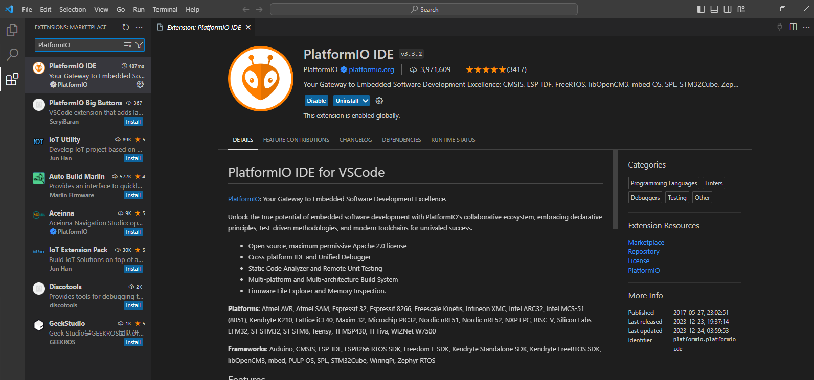
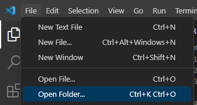
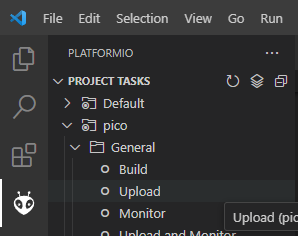
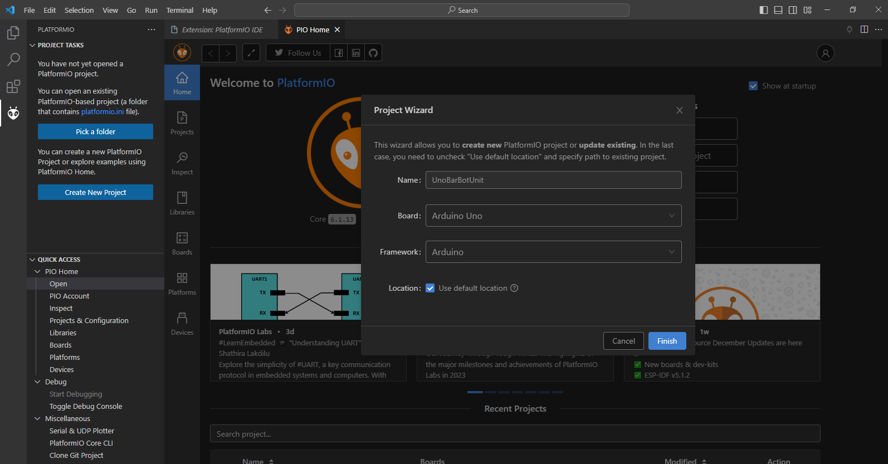
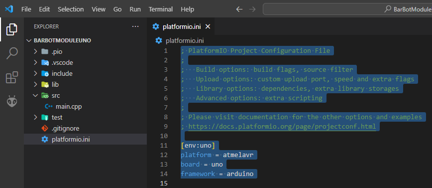

# Template for a BarBotV2 Module 

This is the template that you should use when programming a unit 
intended for BarBotV2.

This is built using the Arduino framework to make it easy for anyone 
of varying skills to build their own modules, but with a few minor 
details that is thoroughly covered. 

This guide is written assuming only a basic knowledge of Arduino programming. 

## Getting Started 

To get started you will need a few things: 

- This is built using the PlatformIO extension for Visual Studio (VS) Code:
    - Make sure you have VS Code installed from [code.visualstudio.com](code.visualstudio.com). 
    - Once installed, open VS Code and in the Extensions tab search for `Platform IO` and install:

    
    
- Download this repository from GitHub via your preferred choice then open the parent folder of it in VS Code. 
    - You can do this by going to File->Open Folder. 

    

    - Select the folder for this repository and Platform IO should load it in. 

This project is for the Raspberry Pi Pico, but since it is built on the Arduino framework it will work for any other board. See [Other Boards](#other-boards)

## Writing Code 

Those used to Arduino and Platform IO would normally start in `src/main.cpp`, but in this template this contains standard code for interacting with the control unit. All the custom code for your unit lives in `lib/Unit/Unit.cpp`. 

There is no `void loop()` or any code that you should be running continuously, there is only `int performAction(int option)` that runs when the control unit requests an action from the unit.  

Apart from this, all the same Arduino functions, features, and concepts will work the same here. 

Place all code you want to execute on startup in `void unitSetup()`, this is like `setup()` when programming regular Arduino, an example would be like setting the pin mode for a given pin: 

```c
void unitSetup()
{
    pinMode(5, OUTPUT);
}
```

Or this could be like initialising a servo, display ext. 

The code you want to run when the control unit requests an action should live inside `int performAction(int option)`. 

If you have a simple unit that say moves a servo back and forth to dispense a shot, you can just add the code to do this and add the `return 0` at the end. 

Here's an example that just flashes an LED: 

```c
int performAction(int option)
{
    digitalWrite(led1, HIGH);
    delay(500);
    digitalWrite(led1, LOW);
    delay(500);
    return 0;
}
```

If your module can do multiple different things, such as light up different LEDs, we can assign each of these a number between 0 and 255 in the control unit, you will then receive the number in the `option` parameter that is passed into the `performAction` function. 

Example: 

```c
int performAction(int option)
{
    switch(option)
    {
        case 1: 
            digitalWrite(led1, HIGH);
            break;
        case 2: 
            digitalWrite(led2, HIGH);
            break;
        default: 
            digitalWrite(led1, HIGH);
            digitalWrite(led2, HIGH);
    }
    return 0;
}
```

If you want to communicate back an error to the control unit, you can simply return a number between 1 and 255 from the `performAction` function (0 meansno error/sucessful). 

Here's an example: 

```c
int performAction(int option)
{
    int temperature = analogRead(ADC_TEMP);

    if (temperature > 900)
    {
        return 3; // Too hot! 
    }

    return 0;
}
```

Once a return is hit in `performAction` function, no more code will be executed until another request is made, it's just jumping to the end of the function. 

Finally, if you look in `lib/Unit/Unit.h`, there is a line in there;

```c
// The I2C address of the unit, can be between 8 and 77 
#define UNIT_ADDRESS 18
```

This defined the address of the unit, so the control unit can communicate with it, these all need to be unique but we only need to worry what this is set to when we plug all the modules in together, but it is worth noting where this is set. 

## Uploading Your Code 

There may be some steps you need to do before you can upload your code depending on the board you are using, it's a good idea to Google `[your board name] Platform IO` for details. 

This guide will describe how to upload to the Raspberry Pi Pico. 

For the Pico, you must plug in your Pico via micro USB **WHILST** pressing the button located on top of the board, a USB mass storage device should appear. 

On the `Platform IO` tab again in VS Code, under `Project Tasks`, click `Upload`, this should the same for all boards. 



For the Pico, the mass storage device should dismount automatically and your Pico should start running the code immediately, with the LED flashing rapidly. To re-upload you should redo the pressing the button and plugging in the USB again before re-uploading. 

Happy Hacking! 

## Other Boards 

Using another board is just a case of setting up a new Platform IO project for your board of choice and copying accross some of the setup code. 

To make a new Platform IO project. 

- Click on the `Platform IO` tab icon on the left hand bar in VS Code. 
- Select `Open` in from the menu list. 
- In the new `PIO Home` window, select `+ New Project`
- Give it a name & search + select a board, here we are using the Arduino Uno
- Make sure the `Framework` is set to `Arduino`



Once the project is created, open the `platform.ini` file, this contains all the deatils about the board, framework ext. for Platform IO, just copy the conetents from the new project to the `platform.ini` in this project. 



Everything from then on should be the same between boards, it may be worth looking up `[your boards name] + Platform IO` for any information that might be useful for using your board of choice in Platform IO (such as uploading code ext.). 
